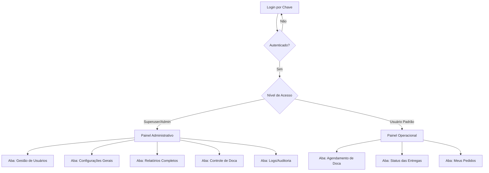

#   PROJETO FINAL CPDI - DJANGO
## DocaLivre - Agendamento inteligente de doca que elimina filas, previne a ociosidade e conecta empresas e fornecedores
## Missão
>Agilizar a rotina de recebimento de mercadoria e filas de esperas, diminuindo os custos, utilizando o agendamento prévio

## Visão 

>Ser utilizada como a principal ferramenta para agilizar o fluxo de entregas em Docas, Centros de Distribuição
## Valores 
> - **Inovação:** Sempre buscar soluções para agilizar o processo
    
>-   **Ética:** Compromisso com a transparência, responsabilidade e respeito pelo colaboradores
    
>-   **Colaboração:** Promover parcerias entre fornecedores e centros de distribuição.
    
>-   **Excelência:** Dedicação para entregar resultados na otimização de tempo de recebimento. 
    
## Idealizador:
                       
- Rafael Fagundes            


## Projetos 

Apresentação do projeto com as propostas e recursos

|                |Propostas                         | Recursos
|----------------|-------------------------------|-----------------------------|
|Pagina Inicial|Mostrar a visão do projeto          |Contato Whatssap, Como funciona e Login        |
|Primeiro Acesso|Automatizar a Entrada do Fornecedor|Criação de uma chave temporária         |
|Login e Senha          |`Logar no Sistema como Fornecedor ou Doca`            |Acessar o Painel          |
|Dashboard        |Visualizar performance           |         |
|Agendamentos        |Mostrar disponibilidade de horários           |         |
|Administração        |Mostrar funcionalidades de Administrador           | Cadastros       |
|...         |`...` |...
## Tarefas Check-List
 - [x] Definição do Projeto
 - [x] Criação do Pitch do Projeto 
 - [ ] Apresentação do Pitch  
 - [x] Levantamento dos Requisitos
 - [x] Página Principal
 - [x] Página de Autenticação
 - [x] Cadastra Fornecedor
 - [x] Página de Autenticação
 - [x] Cadastra Fornecedor
 - [x] Gera Chave Temporária
 - [x] Cadastra Faixa de Horário 
 - [ ] Cadastra a Doca 
 - [ ] Cadastrar Pedidos
 - [x] Dashboard Demonstração (template)
 - [ ] Dashboard Funcional (buscar no banco de dados e manipulação de dados)
 - [x] Agendamento Demonstração (template)
 - [ ] Agendamento Funcional (Verificar docas, horários das docas, pedidos)


## Matemática Aplicada
   Horarios da doca calculados a partir de uma hora inicial e uma hora final e o periodo de descarga
  
   faixas = (horar_final - hora_inicial) / t descarga  

   Obs: Conversão para minutos 

> Sobre expressões matemáticas [aqui](http://meta.math.stackexchange.com/questions/5020/mathjax-basic-tutorial-and-quick-reference).


## UML Diagrams – Projeto Doca


### 1. Estrutura de Módulos (Painel + Abas)



### 2. Hierarquia de Permissões (visão alternativa)

```mermaid
graph LR
    A((Sistema de Doca)) --> B[Superuser/Admin]
    A --> C[Usuário Operacional]

    B --> B1(Gerencia usuários)
    B --> B2(Configura parâmetros)
    B --> B3(Acessa todas as abas)

    C --> C1(Agenda janela de doca)
    C --> C2(Consulta status)
    C --> C3(Acesso restrito por perfil)
